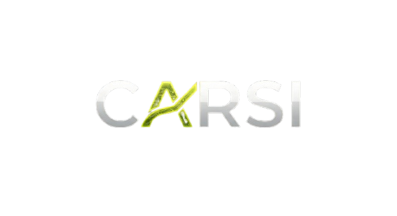

<div align="center">



# CARSI — Online Training LMS

### IICRC-aligned CEC learning for cleaning and restoration professionals in Australia

<p align="center">
  
  
  
  
  
</p>

<p align="center">
  <strong>Courses → Enrolment → Lessons → Progress Tracking → Certificates</strong>
</p>

</div>

---

## About

CARSI is a modern online training learning management system built for restoration and cleaning professionals. Learners can browse and enrol in structured courses, work through modules and lessons, track progress and completion, and generate certificates once requirements are met.

This repo contains the full CARSI web application: public marketing pages, the learner experience, checkout, and an admin dashboard.

---

## What Makes CARSI Different

- **Course-first UX**: built for clarity, progression, and momentum.
- **Progress you can trust**: module/lesson completion tracking with earned outcomes.
- **SEO-ready public site**: metadata, sitemap, and robots.
- **Admin analytics**: see users, enrolments, and completion trends.
- **Payments included**: Stripe-backed checkout for paid training.
- **AI where it helps**: learner guidance, content operations, image support, and audits stay grounded in CARSI data.

---

## Key Features

- Public course catalogue + SEO-first pages
- Learner enrolment and structured learning flows
- Lesson/module progress tracking
- Completion + certificate generation
- Admin dashboard for users and learning analytics
- Stripe checkout + webhooks
- WordPress import pipeline (keeps course data in sync)
- Floating course assistant with provider-gated configuration
- Verification/audit utilities for route, journey, and UX evidence

---

## Learning Flow (From Browse to Certificate)

1. Browse courses on the public site
2. Enrol (free or paid)
3. Complete lessons across modules
4. Track completion and progress
5. Generate your certificate on completion

---

## Tech Stack

- **Frontend**: Next.js 16 App Router, React 19, TypeScript, Tailwind
- **Database**: PostgreSQL
- **ORM**: Prisma 7
- **Payments**: Stripe
- **AI**: focused provider integrations for assistant, image generation, and verification workflows
- **Deployment**: Docker + DigitalOcean App Platform (`app.yaml`, `Dockerfile`)

---

## AI & Stack Hardening

CARSI treats LLMs as bounded assistants, not as the product's source of truth. Auth, payments, enrolments, certificates, discounts, admin permissions, and IICRC-related reporting remain deterministic application logic.

Current AI posture:

- Public/learner assistant: `app/api/margot/chat/route.ts`
- Assistant context: `src/lib/server/ai-assistant-context.ts`
- Model policy: `src/ai/model-registry/`
- Image generation policy/client code: `src/lib/image-generation/`, `src/ai/graphics/`
- Evidence-first verification: `src/lib/agents/independent-verifier.ts`, `src/lib/audit/`

Docs:

- [LLM Capabilities and Stack Hardening](docs/LLM_CAPABILITIES_AND_STACK_HARDENING.md)
- [AI Provider Guide](docs/AI_PROVIDERS.md)
- [Agentic Operating Model](docs/AGENTIC_LAYER_IMPLEMENTATION.md)

---

## Quick Start (Local)

1. Install dependencies
   ```bash
   npm install
   ```
2. Create your environment file
   ```bash
   cp .env.example .env
   ```
3. Update required variables (especially `DATABASE_URL`)
4. Start the dev server
   ```bash
   npm run dev
   ```

To build production locally:

```bash
npm run build
```

---

## Environment Variables

See `app.yaml` for DigitalOcean scopes. Common variables:

- `DATABASE_URL`: Postgres connection string
- `JWT_SECRET`: auth/session token secret
- `NEXT_PUBLIC_FRONTEND_URL`: canonical public URL (must be a valid absolute URL; do not set to an empty string)
- `NEXT_PUBLIC_APP_URL`: app origin used for runtime/CORS configuration
- `NEXT_PUBLIC_STRIPE_PUBLISHABLE_KEY`: Stripe public key
- `STRIPE_SECRET_KEY`: Stripe secret key
- `STRIPE_WEBHOOK_SECRET`: Stripe webhook signing secret
- `ADMIN_EMAIL` / `ADMIN_PASSWORD`: admin bootstrap credentials
- `NEXT_PUBLIC_ADMIN_EMAIL`: admin identifier used by the app
- `OPENAI_API_KEY`: optional AI features
- `OPENAI_CHAT_MODEL`: optional public/learner assistant model override
- `GOOGLE_AI_API_KEY`: optional Gemini/image-generation features

---

## Database & Prisma

Prisma client is generated on install/build (`postinstall` + build script).

Helpful commands:

```bash
npm run prisma:generate
npm run prisma:migrate
```

Production build runs:

- `prisma generate`
- `prisma migrate deploy`
- `next build`

---

## Deployment (DigitalOcean App Platform)

Deployment uses:

- `app.yaml`: service definition + environment variable scopes
- `Dockerfile`: multi-stage build + Next.js standalone output

Notes:

- Some secrets/variables are needed at **build time** (`RUN_AND_BUILD_TIME`) so the container can generate Prisma client and perform SEO/static metadata work.
- Keep `NEXT_PUBLIC_FRONTEND_URL` as a real absolute URL (e.g. `https://carsi.com.au`).

---

## Scripts

```bash
npm run dev
npm run build
npm run start
npm run lint
npm run prisma:generate
npm run prisma:migrate
npm run db:studio
```

---

## Contributing

- Keep changes focused and PR-ready
- Update Prisma migrations when the schema changes
- Make sure `npm run build` succeeds before shipping

---

## License

MIT
