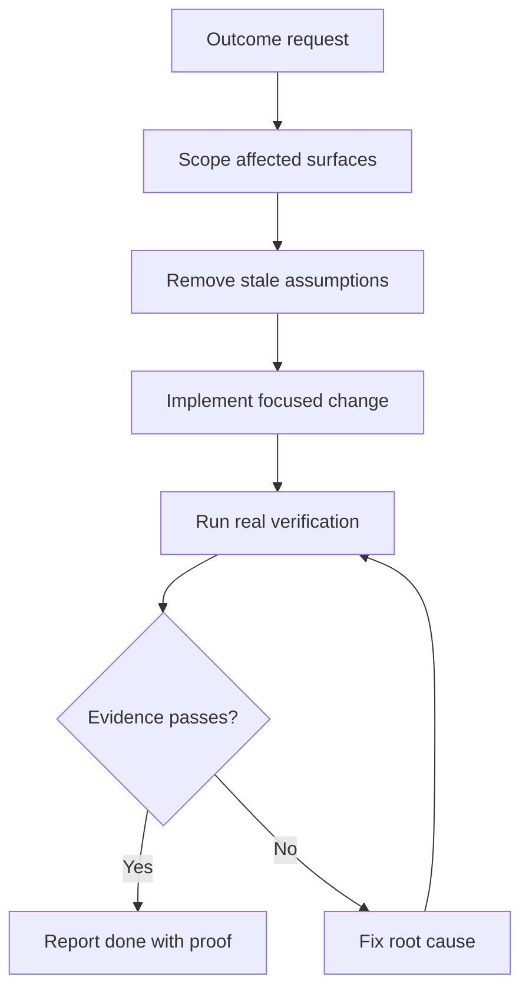

# Agentic Operating Model

Updated: 18/06/2026

This document replaces the older "agentic layer implementation summary" that described Python/FastAPI agent files not present in the CARSI repo. The current truth is simpler and stronger: CARSI uses agentic methods as an operating model around a Next.js LMS, with selected verification utilities in code.

## Status

| Area               | Current state                                                 |
| ------------------ | ------------------------------------------------------------- |
| Product stack      | Next.js 16, React 19, Prisma 7, PostgreSQL, Stripe            |
| Runtime AI         | Public/learner assistant and optional image generation paths  |
| Agent procedures   | `skills/`, `docs/agent-framework/`, `.claude/launch.json`     |
| Verification code  | `src/lib/agents/independent-verifier.ts`, `src/lib/audit/`    |
| Model registry     | `src/ai/model-registry/`                                      |
| Removed assumption | No live `apps/backend/src/agents` Python service in this tree |

## Principle

Agents do not make CARSI trustworthy by producing more text. They make CARSI stronger when they:

- Reduce manual investigation.
- Keep context focused.
- Produce typed artefacts.
- Run real checks.
- Leave evidence.
- Remove unused code, duplicate docs, stale routes, and template leftovers.

## Current Agentic Capabilities

### Independent Verification

`src/lib/agents/independent-verifier.ts` can verify claims against evidence such as:

- File exists.
- File is not empty.
- No placeholder patterns remain.
- Code compiles.
- Lint passes.
- Tests pass.
- Endpoint responds.
- Response time stays under threshold.
- Content contains or does not contain expected text.

Use this pattern whenever an agent claims work is "done". A completion claim without evidence is not a completion claim.

### Audit Primitives

`src/lib/audit/` contains primitives for:

- API route audits.
- User journey runs.
- UX friction detection.
- Evidence collection.
- Scheduled audit orchestration.
- Markdown/JSON/HTML report generation.

These are the right foundation for strengthening the app stack because they evaluate real application surfaces instead of asking an LLM whether things look okay.

### Model And Visual Routing

`src/ai/model-registry/` and `src/ai/graphics/` provide a place to centralise model choices and visual-generation policy. Model IDs drift quickly, so the registry is a review point, not a forever guarantee.

### Human/Agent Skills

`skills/` and `docs/agent-framework/` describe how specialist work should be routed. The hard rule is progressive disclosure: load only the context required for the task. A large context dump is bloat, even when the model can technically accept it.

## Operating Loop

Use this loop for significant product work:

1. Translate the user request into a measurable outcome.
2. Identify the affected runtime surface: route, component, server module, schema, script, or docs.
3. Remove stale assumptions before adding new code.
4. Make the smallest coherent change.
5. Verify with the closest real check.
6. Capture evidence in the final note or report.

## Bloat And Slop Controls

| Risk                                 | Control                                                                                   |
| ------------------------------------ | ----------------------------------------------------------------------------------------- |
| Template architecture copied forward | Compare docs against actual paths before trusting them                                    |
| Duplicate backend logic              | Prefer Next.js route handlers/server modules unless a separate service is justified       |
| Prompt-only reliability              | Use schemas, tests, route checks, and deterministic fallbacks                             |
| Inflated agent claims                | Require evidence artefacts                                                                |
| Model drift                          | Review provider docs before changing model IDs or parameters                              |
| Course-content contamination         | Strip AI-vendor references from learner material unless the lesson is explicitly about AI |
| UI bulk                              | Prefer task-focused LMS screens over decorative AI-generated panels                       |

## AI Feature Done Gate

An AI feature or agent process is done only when:

- The runtime path exists in this repo.
- Environment variables are listed.
- Inputs and outputs are typed.
- Errors degrade safely.
- User-visible claims are source-backed.
- Cost and privacy implications are acceptable.
- Verification evidence exists.

## Near-Term Strengthening Opportunities

- Update `src/ai/version-checks/check-model-currency.ts` so it reads the actual root `.env*` files instead of an old `apps/backend/.env.local` path.
- Align `src/lib/anthropic/types.ts` and `client.ts` with current Anthropic API constraints before enabling them in production.
- Add route-level tests for `app/api/lms/public/chat/route.ts` using mocked provider responses.
- Add a lightweight model-routing wrapper so provider calls are not scattered through routes.
- Add an audit report command that exercises critical LMS journeys: browse course, enrol, complete lesson, generate certificate, admin review.
